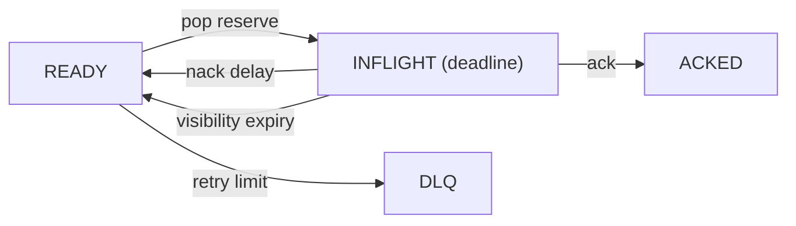

# EmbeddedMQ — Complete Test Catalog

This document lists every automated check in the repository: what it runs, how it is invoked, quick vs long modes, and what failure means.

Related: [TESTING.md](TESTING.md) (how to run / orchestration), [WHERE_WE_WIN.md](WHERE_WE_WIN.md) (perf positioning).

## Categories

| Category | Dir / target | Label | Purpose |
| -------- | ------------ | ----- | ------- |
| Unit / integration | `tests/` | (unit) | Correctness of primitives, API, durable reopen |
| ABI / compat | `test_abi`, `test_compat` | (unit) | Public symbol + layout freeze; log v1 fixtures |
| Stress | `stress/` | `stress` | Long-running conservation / RSS / churn |
| Fuzz | `fuzz/` | `fuzz` | Random op streams + garbage log reopen |
| Fault | `fault/` | `fault` | Forced alloc/disk failures + corruption |
| Recovery | `recovery/` | `recovery` | Kill mid-write + crash-point x fsync matrix |
| Soak | `soak/` | `soak` | Steady mixed load + RSS sampling |
| Differential | `difftest/` | `difftest` | Golden policy model vs real queue every op |
| Model check | `model/` | `model` | Exhaustive BFS of work-queue lifecycle |

---

## How to run everything

```powershell
# Configure + build + all CTest targets
.\scripts\run_all.ps1 -Configure -FaultInject

# Or manually
cmake -B build -DEMQ_BUILD_STRESS=ON -DEMQ_FAULT_INJECT=ON -DEMQ_BUILD_BENCH=ON
cmake --build build --config Release
ctest --test-dir build -C Release --output-on-failure
```

Filter by label:

```powershell
ctest --test-dir build -C Release -L stress
ctest --test-dir build -C Release -L fuzz
ctest --test-dir build -C Release -L fault
ctest --test-dir build -C Release -L recovery
ctest --test-dir build -C Release -L soak
ctest --test-dir build -C Release -L difftest
ctest --test-dir build -C Release -L model
```

Robustness suites registered via `emq_add_suite` always receive `--quick` under CTest (keeps the default gate under a few minutes). Long modes are flag-driven and run via `scripts/` or `.github/workflows/nightly.yml`.

---

## CTest inventory

| # | Name | Dir | Label | Role |
| -- | ---- | --- | ----- | ---- |
| 1 | `test_crc` | `tests/` | (unit) | CRC32 / CRC32C correctness |
| 2 | `test_alloc` | `tests/` | (unit) | Arena + slab allocators |
| 3 | `test_record` | `tests/` | (unit) | Record header encode/decode |
| 4 | `test_fifo` | `tests/` | (unit) | FIFO push/pop primitives |
| 5 | `test_wheel` | `tests/` | (unit) | Timing wheel schedule/fire |
| 6 | `test_routing` | `tests/` | (unit) | Basic pub/sub routing |
| 7 | `test_workqueue` | `tests/` | (unit) | Work queue + ack/nack |
| 8 | `test_registry` | `tests/` | (unit) | Queue registry create/open/remove |
| 9 | `test_api` | `tests/` | (unit) | Public C API smoke |
| 10 | `test_durable` | `tests/` | (unit) | Durable / mmap / hybrid reopen |
| 11 | `test_policies` | `tests/` | (unit) | Queue policy behaviors |
| 12 | `test_routing_advanced` | `tests/` | (unit) | Groups, wildcards, replay helpers |
| 13 | `test_mpmc` | `tests/` | (unit) | MPMC work queue |
| 14 | `test_batch_async` | `tests/` | (unit) | Batch + async callbacks |
| 15 | `test_pool` | `tests/` | (unit) | Size-class page pool + magazines |
| 16 | `test_bitmap` | `tests/` | (unit) | Hierarchical priority bitmaps |
| 17 | `test_lfq` | `tests/` | (unit) | Lock-free log-buffer queue |
| 18 | `test_ebr` | `tests/` | (unit) | Epoch-based reclamation |
| 19 | `test_sched` | `tests/` | (unit) | Active-queue scheduler credits |
| 20 | `test_policy` | `tests/` | (unit) | Orthogonal policy / backpressure decide |
| 21 | `test_record_v3` | `tests/` | (unit) | 32B record header v3 + tiers |
| 22 | `test_cpu` | `tests/` | (unit) | CPU feature detect + ISA dispatch |
| 23 | `test_hist` | `tests/` | (unit) | Latency histogram |
| 24 | `test_task` | `tests/` | (unit) | Stackless tasks / event loop |
| 25 | `test_backpressure` | `tests/` | (unit) | DROP_NEW / DROP_OLD / BLOCK / OVERWRITE |
| 26 | `stress_spsc` | `stress/` | `stress` | SPSC marathon + FIFO + RSS plateau |
| 27 | `stress_mpmc` | `stress/` | `stress` | Multi-queue multi-thread conservation |
| 28 | `stress_churn` | `stress/` | `stress` | Random create/destroy/push/pop |
| 29 | `stress_compact` | `stress/` | `stress` | Compact/snapshot under live traffic |
| 30 | `stress_replay` | `stress/` | `stress` | Durable seek + checksum verify |
| 31 | `fuzz_ops` | `fuzz/` | `fuzz` | Random API op stream + reference model |
| 32 | `fuzz_log` | `fuzz/` | `fuzz` | Garbage segment files must not crash |
| 33 | `fault_alloc` | `fault/` | `fault` | Forced `malloc` failures → `EMQ_ERR_NOMEM` |
| 34 | `fault_disk` | `fault/` | `fault` | Forced `file_pwrite` failures → fail-safe |
| 35 | `fault_corrupt` | `fault/` | `fault` | Offline bit-flip / truncate + reopen |
| 36 | `recovery_supervisor` | `recovery/` | `recovery` | Kill writer mid-append, verify prefix |
| 37 | `soak_runner` | `soak/` | `soak` | Steady mixed load + RSS sampling |

Additional CTest targets beyond the numbered unit/stress block above:

| Name | Dir | Label | Role |
| ---- | --- | ----- | ---- |
| `test_abi` | `tests/` | (unit) | Link-complete public API + layout/enum freeze |
| `test_compat` | `tests/` | (unit) | Frozen `log_v1` fixture + reject newer meta |
| `recovery_crashpoint` | `recovery/` | `recovery` | Crash-point x fsync matrix |
| `diff_runner` | `difftest/` | `difftest` | Golden model vs real after every op |
| `model_workqueue` | `model/` | `model` | Explicit-state BFS of ack/nack/visibility |

Notes:

- `fault_alloc`, `fault_disk`, and `recovery_crashpoint` are **DISABLED in CTest** when `EMQ_FAULT_INJECT=OFF`.
- `recovery_writer` and `gen_fixture` are helpers, not CTest entries.

---

## 1. Unit & integration (`tests/`)

Harness: `tests/emq_test.h` (`EMQ_CHECK` / `EMQ_CHECK_EQ`, non-aborting counters).

| Test | What it covers |
| ---- | -------------- |
| `test_crc` | Software CRC32; hardware CRC32C path when available |
| `test_alloc` | `emq_arena` / `emq_slab` init, alloc, free, destroy |
| `test_record` | Legacy record pack/unpack |
| `test_fifo` | In-memory FIFO primitive path |
| `test_wheel` | Schedule delayed callbacks; tick fires on time |
| `test_routing` | Publish / subscribe / `sub_next` |
| `test_workqueue` | Visibility timeout, ack, nack |
| `test_registry` | Named queue table growth and lookup |
| `test_api` | Runtime lifecycle, push/pop/release via public API |
| `test_durable` | DURABLE / MMAP / HYBRID: push → snapshot → compact → destroy → recreate → pop |
| `test_policies` | Policy matrix (FIFO, priority, ring, delay, …) |
| `test_routing_advanced` | Consumer groups, patterns, retry / DLQ helpers |
| `test_mpmc` | Concurrent producers/consumers on work path |
| `test_batch_async` | `push_batch` / `pop_batch` / async completion |
| `test_pool` | Size classes, magazine refill, malloc fallback, stats |
| `test_bitmap` | Set/clear/scan hierarchical bits |
| `test_lfq` | SPSC/MPMC ring push/pop, empty/full |
| `test_ebr` | Retire + reclaim under quiescent epochs |
| `test_sched` | Activate once, pop ready, credit default, priority band order |
| `test_policy` | `emq_policy_decide_full` return codes per BP mode |
| `test_record_v3` | 32-byte header, inline / pooled / blob thresholds |
| `test_cpu` | Feature bits + ops table non-null |
| `test_hist` | Record samples; percentile buckets |
| `test_task` | Protothread yield/delay with `worker_threads=0` + `emq_run_once` |
| `test_backpressure` | Fill to capacity; assert DROP_NEW→FULL, DROP_OLD/OVERWRITE accept, BLOCK→BUSY then unblock after pop |

---

## 2. Stress suite (`stress/`)

Shared harness: `testsupport/` (seeded xoshiro RNG, self-verifying payloads `[seq|producer|FNV|body]`, progress watchdog, process RSS/handles).

| Binary | Quick (CTest `--quick`) | Long mode | Assertions |
| ------ | ----------------------- | --------- | ---------- |
| `stress_spsc` | ~200k ops, 1 queue, 1P+1C, FAST FIFO SPSC | `--ops N` (e.g. 1e8–1e10) | Strict FIFO seq order; zero loss; RSS plateau after warmup; watchdog heartbeats |
| `stress_mpmc` | 8 queues, 4 threads, ~50k ops | `--queues 100 --threads 16/64 --ops N` | Per-op payload CRC; conservation `Σpushed == Σpopped + drained + depth` |
| `stress_churn` | ~2 s, max ~200 live queues | `--duration SEC --queues N` (up to 100k) | Random create/destroy/push/pop; watchdog stall abort; no crash |
| `stress_compact` | ~5k ops on DURABLE path | `--ops N --path DIR` | Producer+consumer while `emq_queue_compact` / `emq_queue_snapshot`; payload CRCs |
| `stress_replay` | ~2k durable msgs + random seeks | `--ops N` | Seek/peek checksum verification on durable log |

Common flags: `--seed`, `--payload`, `--ops`, `--queues`, `--threads`, `--duration`, `--path`, `--quick`.

Long orchestration:

```powershell
.\scripts\stress_long.ps1 -Suite all -Ops 100000000
.\scripts\stress_long.ps1 -Suite spsc -Ops 1000000000
```

---

## 3. Fuzz suite (`fuzz/`)

| Binary | Quick | Long | What it does |
| ------ | ----- | ---- | ------------ |
| `fuzz_ops` | 20k RNG ops | `--ops 1000000` or libFuzzer (`EMQ_LIBFUZZER`) | Byte/RNG stream → push/pop/ack/stats/close/reopen on 2 FAST FIFO queues; reference deque must match FIFO seq; depth stats must match |
| `fuzz_log` | ~200 random `.seg` files | higher iter counts | Write garbage bytes as segments; `emq_log_open` + reads must **never crash**; CRC rejects garbage |

```powershell
.\build\fuzz\fuzz_ops.exe --ops 1000000 --seed 42
.\build\fuzz\fuzz_log.exe --quick
```

---

## 4. Fault injection (`fault/`)

Requires build flag **`-DEMQ_FAULT_INJECT=ON`**.

| Binary | Injects | Expectation |
| ------ | ------- | ----------- |
| `fault_alloc` | `malloc` fault (`EVERY_N=1` after runtime create) | Clean `EMQ_ERR_NOMEM`; no abort; after `emq_fault_reset`, runtime usable again |
| `fault_disk` | `file_pwrite` after queue create (`AFTER_N=3`) | Push eventually returns IO/error; reopen recovers contiguous verified prefix |
| `fault_corrupt` | Offline byte-flip / truncate of `*.seg` | Reopen must not crash; salvage valid prefix via CRC |

Env-driven injection (any binary linked with fault inject):

```
EMQ_FAULT=malloc:after:5
EMQ_FAULT=file_pwrite:every:3
EMQ_FAULT=file_short_write:prob:500    # tenths of a percent
EMQ_CRASH_AT=log_sync_pre:1
```

Hooked points:

| Kind | Names |
| ---- | ----- |
| Memory | `malloc` (via `emq_aligned_alloc` / `emq_mem.h`) |
| Disk | `file_pwrite`, `file_short_write`, `file_pread`, `file_sync`, `file_resize`, `mmap_sync` |
| Crash points (`EMQ_CRASHPOINT`) | `log_append_pre`, `log_sync_pre`, `log_sync_post`, `log_meta_write`, `log_blob_write`, `log_segment_rotate`, `log_compact`, `log_snapshot`, `log_trim_front` |

---

## 5. Crash recovery (`recovery/`)

| Binary | Role |
| ------ | ---- |
| `recovery_writer` | Child: DURABLE queue, `FSYNC_EVERY_WRITE`, self-verifying payloads, writes `hwm.txt` after each flush; loops until killed |
| `recovery_supervisor` | Parent: for each cycle → wipe dir → spawn writer → sleep 20–150 ms → `TerminateProcess`/`SIGKILL` → reopen → pop contiguous CRC-valid prefix |

| Mode | Cycles |
| ---- | ------ |
| CTest `--quick` | 5 |
| Default / long | `--cycles N` (plan target up to 5000) |

```powershell
.\build\recovery\recovery_supervisor.exe --quick
.\build\recovery\recovery_supervisor.exe --cycles 1000 --seed 7
```

Pass criteria: process never crashes on reopen; recovered messages form a contiguous verified sequence from 0 (torn tail allowed — verification stops at first bad CRC / gap).

---

## 5b. Crash-point matrix (`recovery_supervisor --crashpoint`)

With `-DEMQ_FAULT_INJECT=ON`, `--crashpoint` runs each named `EMQ_CRASHPOINT` x fsync policy (`NONE` / `EVERY_WRITE` / `INTERVAL`). The child sets `EMQ_CRASH_AT=<point>:1`, self-exits, and the supervisor verifies the contiguous CRC-valid prefix (`EVERY_WRITE` also asserts `recovered >= hwm`).

Quick CTest: first 3 points x `EVERY_WRITE` only.

---

## 5c. Differential testing (`difftest/`)

`diff_runner` drives a golden policy model (`diff_model`) and a real queue in lockstep for FIFO (DROP_NEW/DROP_OLD), LIFO, PRIORITY, RING, and WORK (ack/nack). After every op it compares pop status, payload sequence, and (for FAST FIFO) live depth. Divergence prints `case` + `seed` + op index and aborts.

```powershell
.\build\difftest\diff_runner.exe --quick
.\build\difftest\diff_runner.exe --ops 100000 --seed 7
```

---

## 5d. Model checking (`model/`)

`model_workqueue` exhaustively BFS-explores a bounded abstract work-queue state machine (N<=3 messages, <=12 steps):



Invariants: no lost messages on terminating paths; at most one concurrent INFLIGHT; redelivery only after deadline; retry monotonic to DLQ at limit.

---

## 5e. ABI + version compatibility (`tests/`)

| Target | Role |
| ------ | ---- |
| `test_abi` | Function-pointer table referencing every public `emq.h` symbol; sizeof/offsetof freeze; enum value freeze |
| `gen_fixture` | Writes durable `tests/fixtures/log_v1/` (run manually / CI) |
| `test_compat` | Copy fixture to temp, reopen, verify checksums; craft meta version+1 and assert clean reject |

---

## 6. Soak (`soak/`)

| Binary | Quick | Long |
| ------ | ----- | ---- |
| `soak_runner` | 3 s mixed push/pop on 4 queues | `--duration SEC` or `.\scripts\soak.ps1 -Hours 24` |

Samples RSS / peak RSS / handles / CPU times every 500 ms (CSV via `--csv`). Fails if RSS grows unboundedly vs baseline (quick: >2×).

```powershell
.\scripts\soak.ps1 -Seconds 30 -Csv soak.csv
.\scripts\soak.ps1 -Hours 24 -Csv soak24.csv
```

---

## 7. Benchmarks (`bench/`) — not in CTest

| Binary | Purpose |
| ------ | ------- |
| `emq_bench` | Latency microbench |
| `emq_bench_load` | Queue × payload matrix; p50/p99/p99.9/p99.99; RSS/CPU/csw; CSV + baseline compare |
| `emq_bench_compare` | FAST SPSC vs mutex+linked-list (same workload) |
| `emq_bench_fanout` | 1 publisher → 1/10/100/1000 subscribers; latency + RSS |
| `emq_bench_sched` | Delay-queue fire-time jitter histogram |

Load matrix (full): queues `1,10,100,1k,10k,25k,50k,100k`; payloads up to 1 MB. Quick: `1/10/100` × `64/256/1024`.

```powershell
.\build\bench\emq_bench_load.exe --quick --csv out.csv
.\build\bench\emq_bench_compare.exe --ops 1000000 --payload 64
.\build\bench\emq_bench_fanout.exe --quick
.\build\bench\emq_bench_sched.exe --quick
```

Perf regression gate:

```powershell
.\scripts\perf_check.ps1            # fail if thr < −10% or p99 > +10% vs baseline
.\scripts\perf_check.ps1 -Update    # refresh bench/baselines/windows-x64.csv
```

Baseline file: [`bench/baselines/windows-x64.csv`](../bench/baselines/windows-x64.csv).

---

## 8. Sanitizers & memory checkers (`scripts/sanitize.ps1`)

Runs under **WSL** (Clang / Valgrind):

| Mode | Command | Covers |
| ---- | ------- | ------ |
| ASan + UBSan | `.\scripts\sanitize.ps1` | Use-after-free, overflows, UB |
| TSan | `.\scripts\sanitize.ps1 -Mode thread` | Data races on threaded suites |
| Valgrind | `.\scripts\sanitize.ps1 -Mode valgrind` | Leaks / invalid access on unit tests |

CMake: `-DEMQ_SANITIZE=address;undefined` or `thread`; MSVC: `-DEMQ_ASAN=ON`.

---

## 9. Shared testsupport (`testsupport/`)

| Facility | Use |
| -------- | --- |
| `emq_rng_*` | Seeded xoshiro256**; seed always printed for replay |
| `emq_cli_*` | `--ops --duration --threads --queues --seed --cycles --payload --csv --path --quick` |
| `emq_payload_fill/check` | Self-verifying 16B header + body FNV |
| `emq_watchdog_*` | Abort if heartbeats stall (deadlock/livelock) |
| `emq_proc_sample` | RSS, peak RSS, handles, user/kernel time |
| `EMQ_REQUIRE` | Abort-on-fail assert for stress/fuzz/fault |

---

## 10. Invariants checked across suites

- Self-verifying payloads (sequence + producer id + FNV checksum)
- FIFO ordering (SPSC stress + fuzz reference model)
- Conservation: `Σpushed == Σpopped + remaining depth` (MPMC)
- Watchdog: stalled heartbeats → abort (deadlock/livelock)
- RSS plateau / bounded growth (SPSC stress, soak)
- Backpressure semantics (unit + policy)
- Durable reopen after kill / IO fault / offline corruption → contiguous CRC-valid prefix
- No crash on garbage log segments (fuzz_log)
- Clean `EMQ_ERR_NOMEM` under alloc faults; runtime remains usable after reset

---

## 11. Build options that affect tests

| Option | Default | Effect |
| ------ | ------- | ------ |
| `EMQ_BUILD_TESTS` | ON | Unit/integration under `tests/` |
| `EMQ_BUILD_STRESS` | ON | stress / fuzz / fault / recovery / soak / difftest / model |
| `EMQ_BUILD_BENCH` | ON | Benchmarks (manual; not CTest) |
| `EMQ_FAULT_INJECT` | OFF | Enables fault hooks; enables `fault_alloc` / `fault_disk` in CTest |
| `EMQ_SANITIZE` | "" | Clang/GCC `-fsanitize=` list |
| `EMQ_ASAN` | OFF | MSVC `/fsanitize=address` |

---

## 12. Scripts cheat sheet

| Script | Purpose |
| ------ | ------- |
| `scripts/run_all.ps1` | Configure (optional) + build + full CTest |
| `scripts/stress_long.ps1` | Billion-op / multi-minute stress |
| `scripts/soak.ps1` | Timed soak → CSV |
| `scripts/perf_check.ps1` | 3× quick load median vs baseline gate |
| `scripts/sanitize.ps1` | WSL ASan/UBSan, TSan, or Valgrind |

---

## 13. Mapping to robustness rubric

| Class | Covered by |
| ----- | ---------- |
| Unit tests | `tests/test_*` |
| Integration / functional | `test_api`, `test_durable`, `test_routing*`, `test_batch_async`, `test_task` |
| Microbenchmarks | `emq_bench`, `emq_bench_compare` |
| Load testing | `emq_bench_load` |
| Stress testing | `stress_*` + `stress_long.ps1` |
| Soak testing | `soak_runner` + `soak.ps1` |
| Fault injection | `fault_*` + `EMQ_FAULT` / `EMQ_CRASH_AT` |
| Fuzz testing | `fuzz_ops`, `fuzz_log` |
| Crash recovery | `recovery_supervisor`, `recovery_crashpoint` |
| Differential testing | `diff_runner` |
| Model checking | `model_workqueue` |
| ABI / compat | `test_abi`, `test_compat` |
| Scalability | load matrix 25k/50k/100k queues; fanout 1→1000; MPMC threads |
| Sanitizers | `sanitize.ps1` |
| Perf regression | `perf_check.ps1` + `bench/baselines/windows-x64.csv` |
